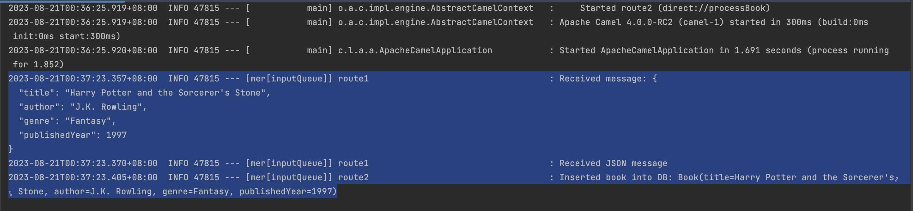

# Sample Camel-ActiveMQ-MyBatis-H2 Application

## Introduction

The Camel routes in `MyRoute.java` are configured to listen for messages from ActiveMQ and process them.

The H2 database is automatically initialized and used by the application for data storage.

## Prerequisites

### Apache ActiveMQ Installation

#### macOS (Using Homebrew):
1. Install Apache ActiveMQ using Homebrew:
    ```
    brew install apache-activemq
    ```
2. Start ActiveMQ:
    ```
    brew services start activemq
    ```

#### Windows:
1. Download ActiveMQ distribution from https://activemq.apache.org/download.html
2. Extract the downloaded archive.
3. Navigate to the extracted directory and run the following command to start ActiveMQ:
   ```
   bin\activemq.bat start
   ```
## Access the ActiveMQ Admin Console

After the Apache ActiveMQ installation and starting the service, you can access the ActiveMQ admin console using a web browser:

- URL: [http://localhost:8161](http://localhost:8161)
- Username: `admin`
- Password: `admin`

This admin console allows you to monitor and manage your ActiveMQ broker.


## Run the Application
```
mvn spring-boot:run
```

## Access the H2 Console

You can access the H2 console to interact with the database using the following URL:

[http://localhost:8080/h2-console](http://localhost:8080/h2-console)

Use the following settings to connect:

- JDBC URL: `jdbc:h2:mem:testdb`
- Username: `sa`
- Password: (leave it empty)

**Note:** The connection details are based on the settings defined in `application.properties`. The H2 console is accessible via `localhost:8080`.


